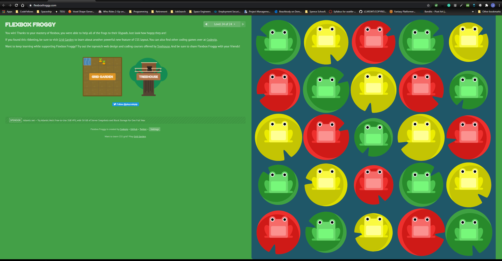

# Notes for Read 03 - Flexbox and Templating

## Templating with Moustache (moustache.js)

Moustache is a *specification* for a templating language.

Example of *moustache* syntax

```
var nameObject = {"name": "Sherlynn"}
res.render('hello', nameObject)
```
**res.render** will bass the data to the HTML where there is a placeholder

## Flexbox

[A Complete Guide to Flexbox](https://css-tricks.com/snippets/css/a-guide-to-flexbox/)

This guide will show you how to utilize *Flexbox* to organize *containers* via CSS

## Flexbox Froggy

### Flexbox Froggy Complete



[&lt;--&#91;BACK&#93;](/README.md)
