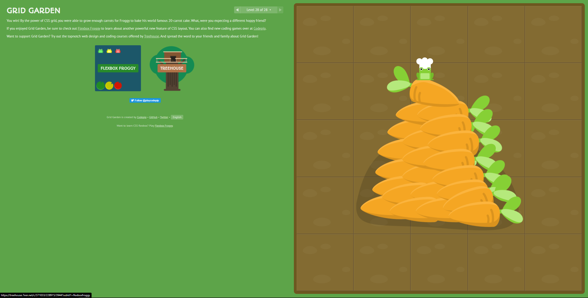

# Notes for Read 04 -  Responsive Web Design and Regular Expressions

## CSS Grid Garden

### CSS Grid Garden

Completed Tutorial

### RegExr

A tool to examing and test *regular expressions* which is defined a sequence of characters that define a search pattern

###  RegEx

Used to extract information from text

Basic examples.  Used from [Regex Tutorial](https://medium.com/factory-mind/regex-tutorial-a-simple-cheatsheet-by-examples-649dc1c3f285) website.

+ `^The`        matches any string that starts with The
+ `end$`        matches a string that ends with end
+ `^The end$`   exact string match (starts and ends with The end)
+ `roar`        matches any string that has the text roar in it
+ `abc*`        matches a string that has ab followed by zero or more c
+ `abc+`       matches a string that has ab followed by one or more c
+ `abc?`        matches a string that has ab followed by zero or one c
+ `abc{2}`      matches a string that has ab followed by 2 c
+ `abc{2,}`     matches a string that has ab followed by 2 or more c
+ `abc{2,5}`    matches a string that has ab followed by 2 up to 5 c
+ `a(bc)*`      matches a string that has a followed by zero or more copies of the sequence bc
+ `a(bc){2,5}`  matches a string that has a followed by 2 up to 5 copies of the sequence bc
+ `a(b|c)`     matches a string that has a followed by b or c (and captures b or c)
+ `a[bc]`      same as previous, but without capturing b or c
+ `\d`         matches a single character that is a digit
+ `\w`         matches a word character (alphanumeric character plus underscore) !
+ `\s`         matches a whitespace character (includes tabs and line breaks)
+ `.`          matches any character

[&lt;--&#91;BACK&#93;](/README.md)
